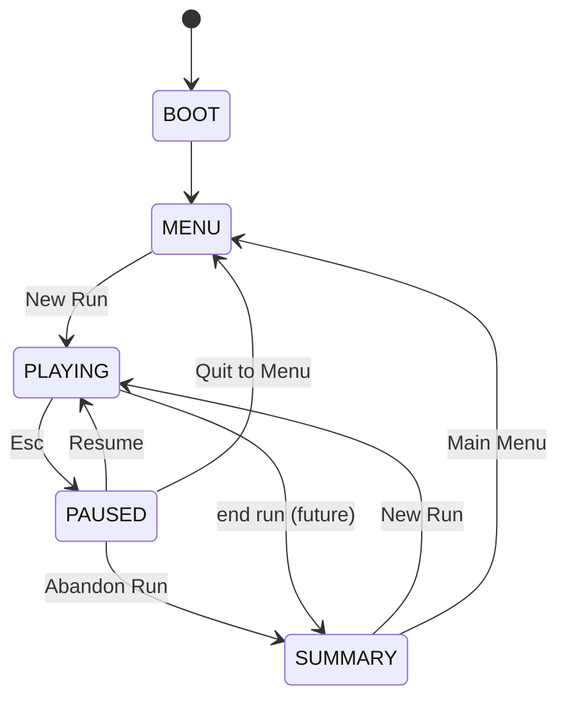

# Game shell

Ship gameplay lives under a **root shell** that owns flow transitions. Gameplay
scenes emit on a signal bus; HUD and menus listen — no per-frame god-scripts on
the scene root.

## Autoloads

| Autoload | Role |
|---|---|
| `GameState` | `BOOT → MENU → PLAYING → PAUSED → SUMMARY`; sets `get_tree().paused` |
| `GameEvents` | Decouples cargo, bank, compass, toasts, upgrades from UI |
| `Settings` | `user://settings.cfg`; sensitivity, invert-Y, FOV, volumes, HUD scale |

Menu screens use `process_mode = PROCESS_MODE_ALWAYS` so they work while paused.

## Scene map

```
scenes/Main.tscn          # App shell (main_scene) — ScreenStack + hosts
scenes/BhSurvival.tscn    # Legacy BH survival slice (unchanged gameplay)
scenes/BhMenuBackdrop.tscn # Menu backdrop — slow orbit on BH shader
scenes/Ship.tscn          # Explore gameplay (instanced under shell)
scenes/screens/*.tscn     # MainMenu, PauseMenu, SettingsMenu, UpgradeScreen, RunSummary
scenes/ui/GameHud.tscn    # HUD component (chevron, reticle, toasts)
```

## State transitions



## Depot gating (single radius)

All depot interactions use **`WorldScale.DEPOT_RADIUS_UNITS` (80 km)**. Upgrades
open only as a **docked screen** inside that radius — not via Y key in deep space.

See [F008](../features/F008-game-shell.md), [F009](../features/F009-settings-audio.md),
[F010](../features/F010-hud-component.md).
