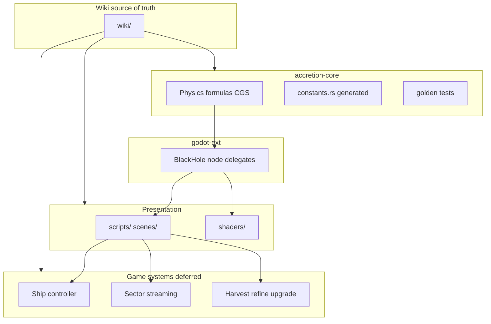

# Architecture overview



## Repository map

```
accretion/
├── wiki/                       # Source of truth (this tree)
├── crates/
│   ├── accretion-core/         # Pure physics (CGS), cargo-testable
│   └── godot-ext/              # Thin gdext binding
├── scenes/                     # Godot scenes
├── scripts/                    # GDScript glue
├── shaders/                    # Lensing + sky
├── accretion.gdextension       # Native lib wiring
└── scripts/check_*.sh          # Mechanical invariant + wiki checks
```

## Data flow (physics)

```
Player input → godot-ext (BlackHole) → accretion-core → numbers out → shader/HUD
```

Game-system loops (ship flight, harvesting) live in GDScript for now; any formula
that must be physically honest goes to `accretion-core` with citation + golden test.

See [layers.md](layers.md) for layer responsibilities.
