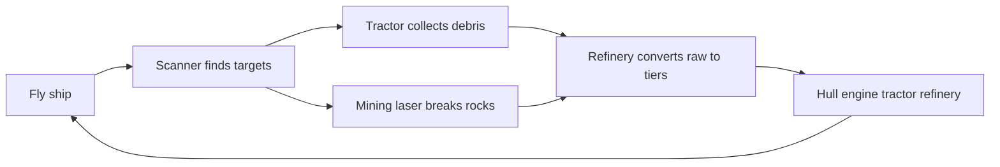

# Resource collection loop

Target gameplay loop after flight ([F001](../features/F001-third-person-flight.md)).
Implementation order: tractor → laser mining → refinery → upgrades.

## Collection tools (no combat)

| Tool | Fantasy | Resource role |
|---|---|---|
| **Tractor beam** | Pull loose debris, dust clouds | Bulk mass — fuel stock, future disk feed |
| **Mining laser** | Break asteroids / wreckage | Structural metals — hull hardening |
| **Refinery** | Process fragments onboard | Raw → tiered materials |

## POI types (future)

| POI | Rarity | Yield |
|---|---|---|
| Debris fields | Common | Bulk volatiles |
| Metallic asteroids | Uncommon | Mid-Z metals (Fe, Ni, Si) |
| Supernova remnants | Rare | r-process heavy elements (future exotic matter) |

Heavy elements near supernovae is the realism hook — when implemented, yields
belong in `accretion-core` with citation + golden test.

## Upgrade axes (future)

| Axis | Gameplay | Visual |
|---|---|---|
| Size | Cargo, tractor width | Hull scale |
| Speed | Sector travel | Engine glow, trails |
| Power | Laser output, reactor | Hardpoints, core glow |
| Hardening | SNR survivability | Armor plates, shield VFX |

## Explicitly out of scope (current slice)

- Combat and hostiles
- Black hole feeding / Eddington survival integration
- Prestige / universe reset
- Wormhole transit
