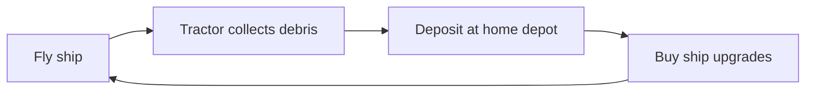
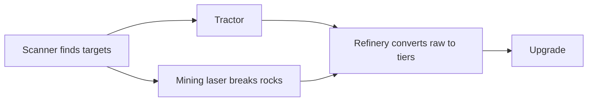

# Resource collection loop

Target gameplay loop after flight ([F001](../features/F001-third-person-flight.md)).
**v1 loop implemented** via [F004](../features/F004-home-depot-progression.md) and
[F005](../features/F005-seeded-sector-debris.md). Refinery and laser remain future.

Deferred path (future):

## Outward pressure (v1)

Each run tracks a **sector ring goal** (Chebyshev distance from origin). Clearing a
sector's harvestables triggers a toast; reaching a ring advances the HUD mission to
the next ring. Richer debris density/mass scales with distance per [F005](../features/F005-seeded-sector-debris.md).

## v1 upgrade axes (F004)

| Axis | Gameplay | Levels |
|---|---|---|
| **Cargo** | +100 u capacity per level | 2 |
| **Tractor range** | +40 u per level | 2 |
| **Cruise accel** | +25% cruise thrust per level | 2 |

## Collection tools (no combat)

| Tool | Fantasy | Resource role |
|---|---|---|
| **Tractor beam** | Pull loose debris, dust clouds | Bulk mass — fuel stock, future disk feed |
| **Mining laser** | Break asteroids / wreckage | Structural metals — hull hardening (future) |
| **Refinery** | Process fragments onboard | Raw → tiered materials (future) |

## POI types (future)

| POI | Rarity | Yield |
|---|---|---|
| Debris fields | Common | Bulk volatiles |
| Metallic asteroids | Uncommon | Mid-Z metals (Fe, Ni, Si) |
| Supernova remnants | Rare | r-process heavy elements (future exotic matter) |

Heavy elements near supernovae is the realism hook — when implemented, yields
belong in `accretion-core` with citation + golden test.

## Upgrade axes (future beyond F004)

| Axis | Gameplay | Visual |
|---|---|---|
| Size | Hull scale | Hull scale |
| Power | Laser output, reactor | Hardpoints, core glow |
| Hardening | SNR survivability | Armor plates, shield VFX |

## Explicitly out of scope (current slice)

- Combat and hostiles
- Black hole feeding / Eddington survival integration
- Prestige / universe reset
- Wormhole transit
- Scanner discovery verb
