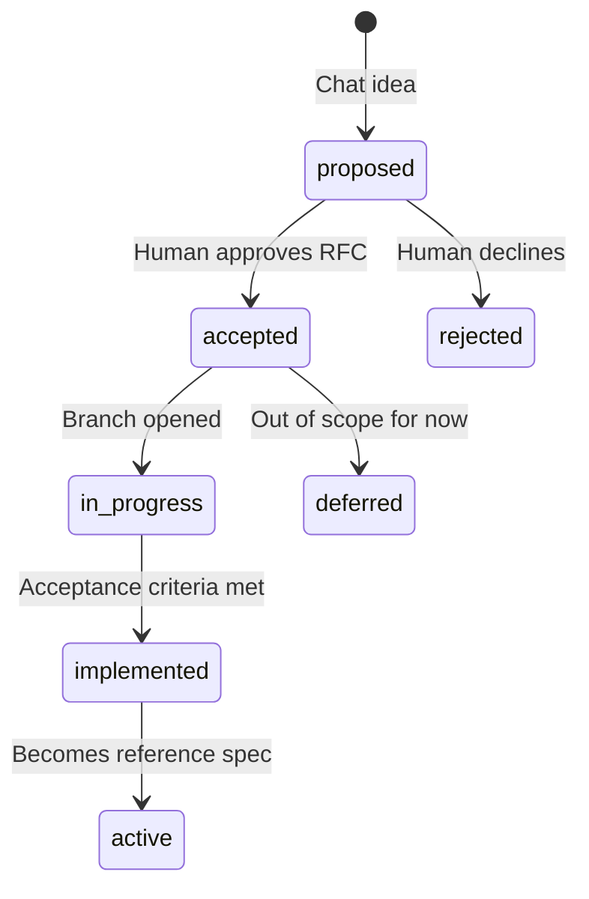

# Concept to implementation

How game concepts become code without losing the wiki as source of truth.

## State machine

## Obligations

1. **New concept** — copy [`features/_template.md`](../features/_template.md),
   assign the next `F###` id, set `status: proposed`, add an entry to
   [`manifest.yaml`](../manifest.yaml).
2. **No implementation** while `status` is `proposed` or `deferred`, unless
   the user explicitly overrides in chat — then update the wiki in the same
   session/PR.
3. **Implementation PR** — cite feature `id:` in the PR summary; move status to
   `in_progress` then `implemented`; fill `implements:` with code paths; update
   [`locked-decisions.md`](../game-design/locked-decisions.md) if a design lock
   changed.
4. **Behavior change without a new RFC** — update the existing feature page and
   `last_reviewed` in the same PR.
5. **User-facing release** — add an entry to [`CHANGELOG.md`](../../CHANGELOG.md);
   the wiki holds the full spec.

## Status meanings

| Status | Meaning |
|---|---|
| `proposed` | Idea captured; not approved for build |
| `accepted` | Approved; may be implemented |
| `in_progress` | Active development |
| `implemented` | Acceptance criteria met; `implements:` filled |
| `deferred` | Valid idea; not current priority |
| `rejected` | Will not build; reason in page body |
| `active` | Living reference doc (non-feature pages) |
| `superseded` | Replaced by another page; link successor |
